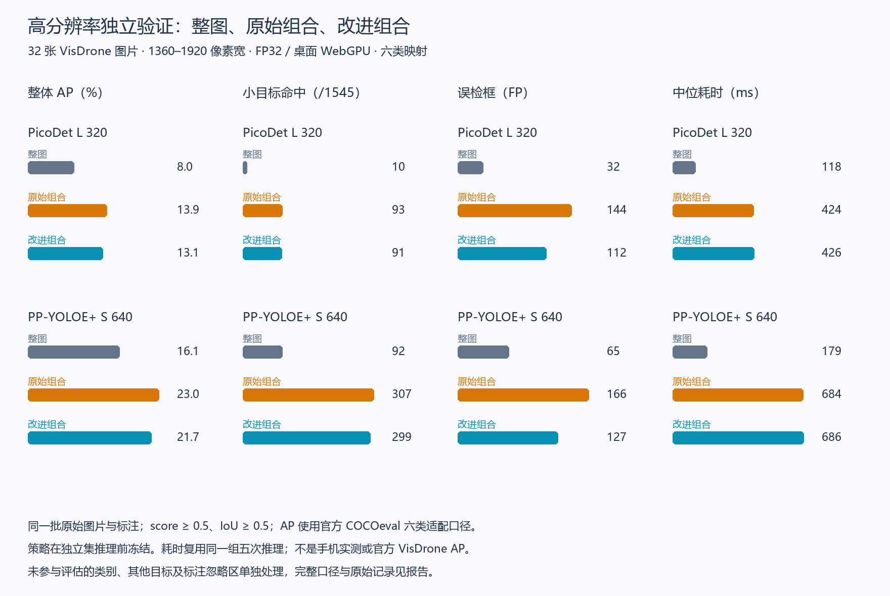

# 切片合并改进与独立高分辨率验证

实验于 2026-09-12 开始，2026-09-13 完成收尾。正式 SDK 基线为 0.3.2（`152b176`），第一轮实验提交为 `ef8efcd`。本轮只有实验脚本、数据锁和报告变更。

**结论：合并改进有效，真实高分辨率图片上也保留了多数小目标收益，但仍未通过预设的默认启用门槛。** 建议保留普通整图路径；如接入产品，定位应为默认关闭、可取消的“小目标增强（实验）”，先完成内存、进度和手机验证。本轮没有修改 SDK/Demo 或发布。

## 独立验证的主要结果

固定 32 张 VisDrone val 图片，原始尺寸 1360×765 至 1920×1080，2363 个参与评估的普通标注，其中 1545 个小目标、80 个大目标。以下是 **FP32、桌面 WebGPU** 的结果。AP 为百分数；命中和 FP 使用 score ≥ 0.5、IoU ≥ 0.5。

| 模型 / 模式 | 整体 AP | 小目标命中 /1545 | FP | 固定阈值精确率 | 大目标 AP | 每图中位耗时 |
| --- | ---: | ---: | ---: | ---: | ---: | ---: |
| PicoDet 整图 | 8.04 | 10 | 32 | 89.61% | 67.36 | 118.1 ms |
| PicoDet 原始组合 | 13.88 | 93 | 144 | 79.34% | 76.21 | 424.2 ms |
| PicoDet 改进组合 | 13.11 | 91 | 112 | 83.03% | 70.33 | 425.8 ms |
| PP-YOLOE 整图 | 16.06 | 92 | 65 | 88.60% | 78.68 | 179.1 ms |
| PP-YOLOE 原始组合 | 22.99 | 307 | 166 | 83.66% | 80.59 | 684.5 ms |
| PP-YOLOE 改进组合 | 21.68 | 299 | 127 | 86.83% | 78.24 | 686.0 ms |

相对原始组合，改进组合分别减少 **22.2% / 23.5% 的 FP**，保留 **97.8% / 97.4% 的小目标总命中**；相对整图净增 81 / 207 个小目标，均未丢失原先命中的小目标。PP-YOLOE 原始组合新增 217、丢失 2，改进组合新增 207、丢失 0。改进并不在所有指标上优于原始组合：两模型的整体 AP 分别少 0.77 / 1.31 点，大目标 AP 也低于原始组合，但接近或超过整图基线。

小目标召回的绝对值仍偏低：改进后的 PicoDet 为 91/1545（5.89%），PP-YOLOE 为 299/1545（19.35%），不能用倍数增加掩盖大量漏检。PP-YOLOE 的整体固定阈值精确率从整图的 88.60% 降到 86.83%，全部 TP 从 505 增到 837，FP 从 65 增到 127；这是需要按应用容忍度决定的权衡。

WebGPU 的改进组合耗时约为整图的 3.6 / 3.8 倍。WASM FP32 的中位耗时分别为 338.5 → 1618.0 ms、988.1 → 4849.3 ms。合并规则本身只增加少量时间，主要代价仍是四次额外推理。没有移动端耗时或峰值内存证据。

六变体 WebGPU 和两模型 FP32 WASM 共 8 个组合、24 行结果见 [完整对照](comparison.md)与 [holdout-summary.json](holdout-summary.json)。FP16、W8A32 的总体方向一致；本次未运行它们的 WASM 独立集矩阵。已有模型稳定状态不变。

## 策略如何确定

开发集使用上一轮 COCO 64 图的原始预测，没有重新推理。先固定三个候选：完整保留所有整图框、增加内侧边缘/包含关系过滤、再限制补充框大小。三个候选都未达到预设门槛。

诊断发现：低置信度的整图框会压制高置信度切片框。PicoDet 中有 51 个可匹配小目标的强切片框（涉及 42 个 GT）、PP-YOLOE 有 60 个（49 个 GT）仅被低于 0.5 的整图框重叠阻挡。这些是机制诊断数量，不是最终净命中数。见 [诊断证据](weak-anchor-diagnosis.json)。

因此在运行任何独立集预测前增加 `confident-anchor` 候选：保护 score ≥ 0.5 的整图框，过滤切片内部边缘附近框和与同类强框高度包含的候选，再将剩余弱整图框与切片候选按原 score 做 NMS。几何阈值仍为 IoU 0.5、内侧边距 2%、交集/较小框面积 0.8，没有进行阈值网格搜索。

| COCO 开发集 | 整图 | 原始组合 | 改进组合 |
| --- | --- | --- | --- |
| PicoDet 整体 AP | 33.65 | 35.21 | 38.24 |
| PicoDet 小目标 TP / FP | 42 / 50 | 98 / 246 | 87 / 100 |
| PicoDet 大目标 AP | 66.73 | 52.99 | 67.26 |
| PP-YOLOE 整体 AP | 43.43 | 42.06 | 44.61 |
| PP-YOLOE 小目标 TP / FP | 103 / 83 | 156 / 238 | 145 / 118 |
| PP-YOLOE 大目标 AP | 72.08 | 59.19 | 70.86 |

该候选在开发集显著缓解大目标 AP 损失，但仍不满足全部门槛：两模型 FP 增量都超过 max(10, 整图 FP×20%)；PP-YOLOE 保留的额外小目标收益为 42/53（79.25%），也略低于预设的 80%。按预设的失败后诊断规则选择它，并冻结 [selection.json](selection.json)。独立集推理期间没有改策略或换图。

首次协议、代码和选择结果保存在 `development-v1`；最终协议明确记录这次开发集调整，见 [protocol.md](protocol.md)。开发集结果只用于诊断与选择，不作为独立确认。

## 独立数据与解释边界

数据来自 [VisDrone 官方数据集](https://github.com/VisDrone/VisDrone-Dataset)，下载采用其 [Ultralytics 数据集配置](https://github.com/ultralytics/ultralytics/blob/main/ultralytics/cfg/datasets/VisDrone.yaml)给出的公开镜像。原始压缩文件 81,638,851 字节，获取后的 SHA256 与来源文件保存在 [sources.json](sources.json)；这是本地内容锁，不是上游发布者提供的校验签名。数据仅用于本地研究，没有上传或重新许可。

固定 SHA256 种子排序，先选 16 张兼有小/大目标的图片，再选 16 张其余含小目标图片；长边至少 1280。样本来自 21 个文件名前缀组，每组最多两张，没有把 COCO 图片放大，也未按预测换图。来源、尺寸、原图和原标注哈希、忽略区数量见 [holdout-lock.json](holdout-lock.json)。

此处是 **六类 COCO 映射适配**，不是 VisDrone 官方十类排行榜：pedestrian/people → person，car/van → car，bicycle、truck、bus、motor → 对应 COCO 类别。tricycle、awning-tricycle、others 和 score=0 区域按锁定规则忽略。只评估六类，其他 74 类输出仍保存在原始文件，但不计入这些 FP/AP，因而不代表 Demo 所有类别的误检率。标注转换和 COCO crowd 适配详见 [复现指南](reproduction/README.md)。

COCOeval 使用默认 maxDets；密集图的每类 100 检测上限仍存在。小目标 TP 按面积 <1024 统计，APSmall 沿用官方边界 ≤1024；本独立集恰有 1 条面积等于 1024 的普通标注。数据分布和类别口径不同，不能把本组 AP 与开发集 AP 横向排名，也不构成全量 VisDrone 或跨设备兼容承诺。

## 运行与验收

正式 SDK 0.3.2、ORT Web 1.27.0、Chromium 153.0.8010.12、Windows x64、Intel i5-10400F。WebGPU 报告 `nvidia / blackwell / isFallbackAdapter=false`；不推断浏览器未披露的型号。所有组合 main 模式、关闭回退、WASM 线程数 1，串行运行；统计和完整测试在推理结束后执行。

每图一次解码，原始 RGBA 直接裁切为 2×2、约 20% 重叠，整图一次＋四片各一次。每组合单独预热一图；32 图共 1280 次测量推理，另有 40 次预热。三种模式由同一组推理重建处理时间，分别计入各自合并，模型读取/初始化/预热与 JPEG 字节读取不计入热处理。不能当作三个独立生产调度器的压测结果。

已完成 8/8 浏览器组合，0 pageerror、无 SDK 回退；256 图次的原始组合与冻结合并均经 Node 逐框重算一致。几何、弱框替换与强框保护行为校验通过；COCO 评估封装 21/21 测试通过。前后规范检查均为 required 18 pass、0 fail、4 skip，采用与正式 SDK 产品源码同树的干净检出，理由与边界沿用第一轮验收记录。远程规则未核验，仅称本地合规。

本轮未修改 packages、apps、models 或 SDK manifest，因此未重复上一轮已经通过、且源代码未变化的 SDK/门户全套构建与 UI 回归；具体已有证据见 [第一轮验收](../2026-09-12-tiling/verification.md)。新增实验的脚本、输入、冻结顺序和来源内容另用 `verify.py` 复核。

`browser/`、`predictions/`、匹配压缩文件、转换标注和照片叠框图仅保留本地；轻量索引记录哈希。案例按 FP32 WebGPU 的最高净小目标收益、最高 FP 增量、最大小目标丢失选择。同分按图片 ID；两模型最大小目标丢失均为 0，对应案例是按序首图，不能当作丢失实例。案例清单见 [cases.json](cases.json)，本地图片位于 `figures`。

建议下一步将切片保留为可选实验能力，先明确可接受的额外耗时与误检，再设计切片上限、取消、进度和资源释放。普通图片继续优先使用 PP-YOLOE 整图；其在本独立集的小目标命中 92、FP 65、耗时 179 ms，仍优于 PicoDet 改进组合的 91、112、426 ms。
