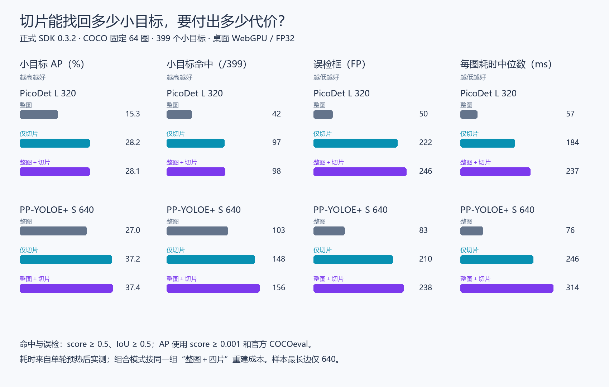

# 小目标切片检测可行性评估

日期：2026-09-12。SDK 基线 `152b176327bf9a68a445818c622e985678ea1c51`（0.3.2）。本地分支 `codex/tiling-evaluation`。

结论：切片确实能找回更多小目标，值得继续研究。当前固定 2×2、20% 重叠、同类 IoU NMS 的方案还不适合直接作为默认检测方式：组合模式的误检明显增加，大目标 AP 下降，耗时约为整图的 4～5 倍。建议下一阶段先评估截断框处理与大目标保护，在独立高分辨率样本上确认收益后，再设计默认关闭的小目标增强选项。

本轮仅增加本地实验、报告及证据；没有修改 SDK runtime、Demo、模型清单或稳定状态，也没有推送和发布。

## 最有用的对照

以下为 **FP32、物理 WebGPU、整图 → 整图＋切片**。AP 按百分制显示；命中和误检使用 score ≥ 0.5、IoU ≥ 0.5。共有 399 个小目标、700 个非 crowd 标注。

| 指标           | PicoDet L 320            | PP-YOLOE+ S 640            |
| -------------- | ------------------------ | -------------------------- |
| 小目标命中     | 42 → 98，新增 56、丢失 0 | 103 → 156，新增 53、丢失 0 |
| 小目标召回     | 10.53% → 24.56%          | 25.81% → 39.10%            |
| 小目标 AP      | 15.28 → 28.08            | 26.97 → 37.39              |
| 整体 AP        | 33.65 → 35.21            | 43.43 → 42.06              |
| 大目标 AP      | 66.73 → 52.99            | 72.08 → 59.19              |
| 全部 TP        | 227 → 317                | 320 → 390                  |
| 全部 FP        | 50 → 246                 | 83 → 238                   |
| 固定阈值精确率 | 81.95% → 56.31%          | 79.40% → 62.10%            |
| 每图耗时中位数 | 56.7 → 236.7 ms          | 76.3 → 313.8 ms            |
| 每图耗时 P90   | 65.2 → 259.9 ms          | 147.6 → 530.8 ms           |

仅切片的大目标 AP 分别降至 23.50、25.37，整体 AP 降至 27.64、34.36，当前证据不支持用它替代整图。组合模式保留了两模型原先命中的全部小目标，并分别在 26/64、24/64 张图片中新增小目标命中；即便如此，整体质量仍有代价。

单线程 WASM 的 FP32 每图中位数：PicoDet 为 288.0 → 1397.9 ms，PP-YOLOE 为 879.6 → 4348.5 ms。该组合方式不适合直接承诺实时视频。FP16、W8A32 也呈现相同的质量权衡；本次没有证据表明换精度能消除切片带来的误检和大目标损失。完整 36 行结果见 [对照表](comparison.md)，未经四舍五入的数据见 [summary.json](summary.json)。

更直接的选择是 **PP-YOLOE 整图优先于 PicoDet 组合模式**：同为 FP32 WebGPU，前者命中 103 个小目标、83 个 FP、整体 AP 43.43、耗时 76.3 ms；后者为 98、246、35.21、236.7 ms。虽然 PicoDet 组合的小目标 AP 略高（28.08 对 26.97），普通图片路径仍优先考虑 PP-YOLOE 整图。切片的后续价值应集中在整图缩放后仍遗漏的小目标场景。

## 失败表现与解释边界

传统的重复误检（未匹配框与已匹配同类 GT 的 IoU ≥ 0.5）在组合模式下两模型均只有 6 个，不能把新增的全部 FP 都归因于这种重复，也不能仅凭降低 NMS 阈值声称问题已解决。切片局部框与完整目标可能具有较低 IoU，仍会被现有去重保留；较高分的局部框也可能压制定位更完整的整图框。案例支持这种风险，但本轮没有逐项归因全部误检。

案例按固定规则从 FP32 WebGPU 结果选出，同分按图片 ID 升序。6 个选择项涉及 4 张不同原图；PicoDet 的最高收益与最大目标损失发生在同一张图，没有为凑数量更换样本。

| 模型     | 选择依据                          | 图片 ID | 小目标新增/丢失 | FP 前/后 | 丢失大目标 |
| -------- | --------------------------------- | ------- | --------------- | -------- | ---------- |
| PicoDet  | 净小目标收益最高 / 丢失大目标最多 | 483999  | 8/0             | 2/7      | 1          |
| PicoDet  | 误检增量最高                      | 209142  | 1/0             | 1/16     | 0          |
| PP-YOLOE | 净小目标收益最高                  | 287874  | 6/0             | 1/4      | 0          |
| PP-YOLOE | 丢失大目标最多                    | 238410  | 4/0             | 5/6      | 1          |
| PP-YOLOE | 误检增量最高                      | 209142  | 1/0             | 11/18    | 0          |

逐例图片、原始来源与许可见 [cases.json](cases.json)。本地叠框图位于 `figures/*.jpg`，可用 [绘图脚本](reproduction/figures.py)重新生成。照片和叠框图保留本地，不纳入 Git；汇总图只展示统计数据。

## 方法与证据

- 数据为预先固定的 COCO val2017 64 图，716 条标注，其中 700 条非 crowd、399 个面积小于 32² 的小目标。六个模型和全部图片均核对 SHA256。原图最长边不超过 640；这不是高分辨率航拍或大图验证。
- 对照规则在实测前固定于 [protocol.md](protocol.md)：整图、四片、整图＋四片；每轴片长 ceil(原长/1.8)、两端对齐，直接裁切原始 RGBA。SDK 完成预处理、推理与原坐标恢复，跨片采用同类 IoU > 0.5 贪心 NMS。
- 正式 SDK 的 `createPPDetection()` / `detect()` 被用于全部实验；保留正式清单的 IoU 0.5，不更换模型，不新增训练。两模型 × FP32/FP16/W8A32 × WebGPU/WASM 均完成完整 64 图，合计 3840 次测量推理，另有 60 次预热。两图预检单独存档。
- 环境为 Windows 11（10.0.26200）、Intel i5-10400F、Chromium 153.0.8010.12、ORT Web 1.27.0。WebGPU 为 `nvidia / blackwell / isFallbackAdapter=false`，浏览器未披露具体 device；不据此猜测显卡型号。WASM 线程数 1，main 模式，关闭回退与模型缓存。ORT 内部部分算子分配至 CPU 的警告原样保留，不宣称全部算子均在 GPU。
- JPEG 统一解码一次、切片无预缩放。每组合独立预热一张整图和四片，64 图交替整图/切片先后。组合间串行，推理矩阵完成后才运行汇总、构建和完整测试。三模式耗时由同一组五次推理重建；包括解码、预处理、检测、裁切和合并，不含模型读取、初始化、图像字节读取。加载及预热耗时单独存档。没有测峰值内存，单轮观测不代表稳定压测或手机性能。
- 使用官方 pycocotools 2.0.11 bbox COCOeval，AP 的最低 score 为 0.001。固定阈值匹配保留官方同类一对一、crowd 忽略和 maxDets 规则。小目标新增/丢失根据 GT ID 计算，不用框数代替命中数。当前数据没有 area 恰好为 1024 的实例。
- 本样本是此前已使用的探索性子集，不等于全量 COCO 或独立确认测试。历史报告曾将 SDK 后处理 IoU 设为 1；本轮保留正式 0.5，质量基线只能与本轮同设置比较。

[复现指南](reproduction/README.md)包含完整命令；[输入锁](inputs.json)固定模型、SDK、协议与数据字节。[summary.json](summary.json)包含每组合环境、会话耗时、运行脚本和原始文件哈希。`browser/*.json.gz` 保存全部原始框、逐片映射、每图耗时、预热与警告，`matches.json.gz` 保存全部匹配；二者只在本地保留，可重算全部指标。[验收记录](verification.md)说明检查、构建和证据复核结果。

## 下一阶段建议

先做第二轮有边界的实验，再讨论产品 API：

1. 保留整图作为基础，给切片来源、内侧边界截断和框包含关系建立可追溯标记；比较保留完整大框、跨尺度合并或边缘置信度处理。不要仅继续增加切片数量。
2. 在当前 64 图上只做诊断，锁定新合并策略后，用独立、具有小目标和大目标标注的高分辨率图片确认；同时观察背景误检、密集目标误合并和大目标 AP。
3. 只有小目标收益保留、整体 AP 与误检代价可接受后，再接入默认关闭的“小目标增强”选项，并实现切片数量上限、进度、取消与内存释放。届时验证手机；本轮无需再让用户重复手动测试六个现有模型。
